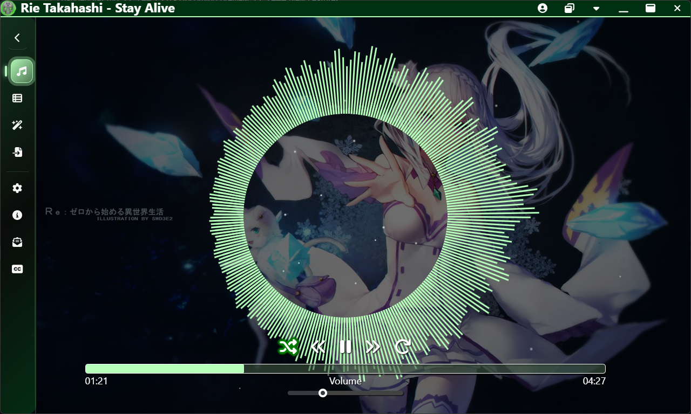
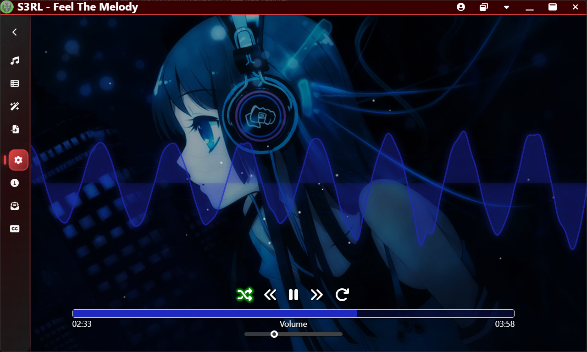
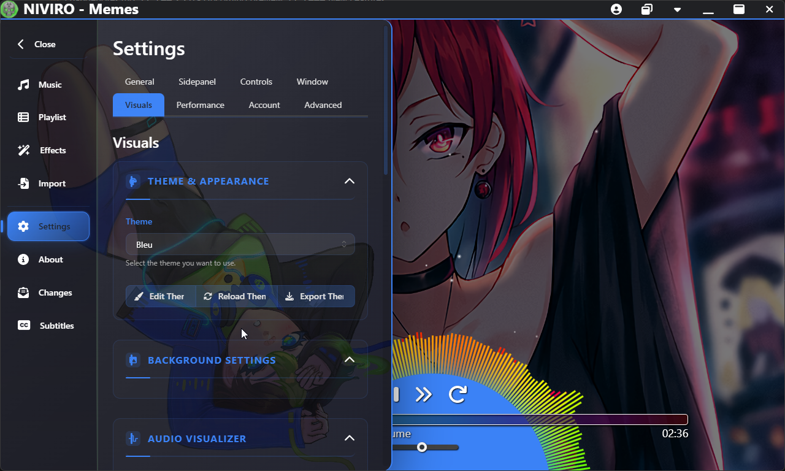
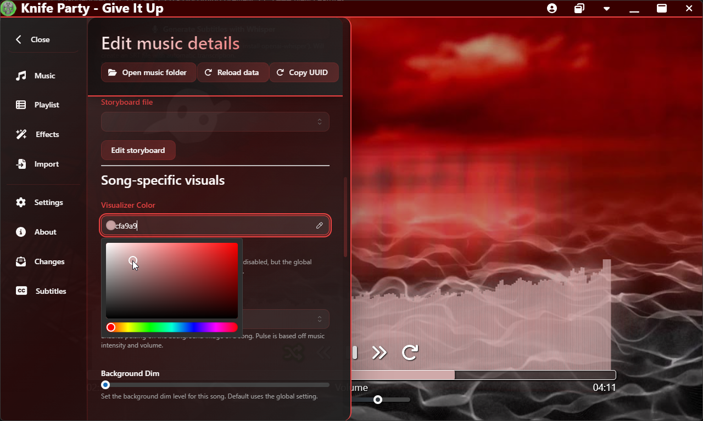
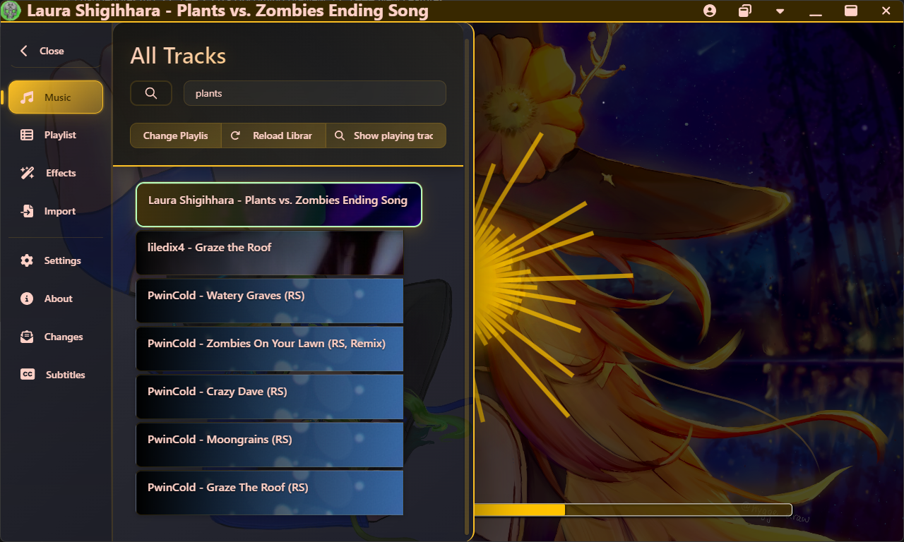
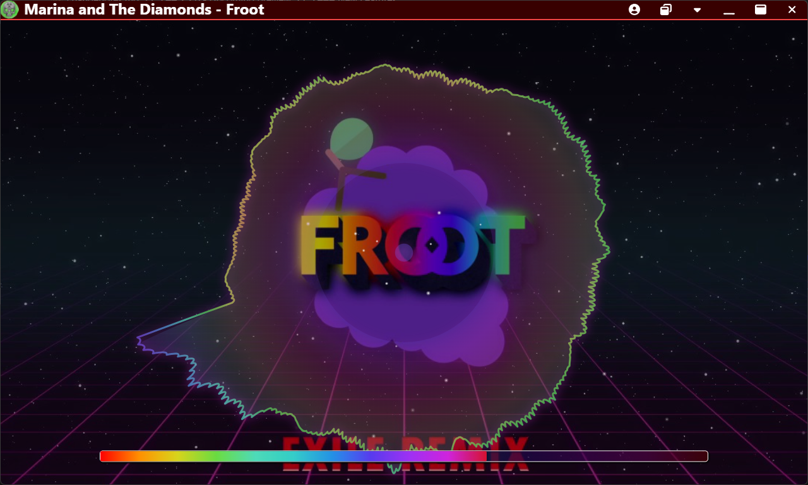

# Toxen - Music player for *your* experience

Have you ever found yourself searching for YouTube videos that display a cool visualizer for your favorite song, only to feel slightly wrong, or not quite to your personal taste? Or maybe you wanted to listen to your favorite song, but it hasn't been created for that one song you love!

**Toxen was built for you**, my friend.

## What is Toxen?
Toxen is at it's core, a highly customizable music player for your local music library.

Toxen has a strong focus on user customization, visualization, and audio effects. It is designed to be a powerful tool for making your music experience more immersive and enjoyable.

No piece of music is alike, nor is the way any given person wants to experience it. Toxen is designed to be flexible and customizable, allowing you to tailor your music experience to your liking. Pick your desired background and visualizer for your song, customize the colors, or even add audio effects to enhance your listening experience.

## Key Features
- **Customizable Visualizers**: Choose from a variety of visualizers, each with its own unique style and effects. Customize colors, styles, and more to match your mood or theme.
- **Support for audio and video**: Play both audio and video files. If it's supported on the web, it is supported in Toxen. This includes formats like MP3, OGG, FLAC, WAV, and MP4.
- **Customizable Backgrounds**: Set a custom background for each song, or use a global background. Toxen supports many image formats, and animated GIFs as backgrounds.
- **Drag and drop support**: Easily add your music files, backgrounds, and more to Toxen by dragging and dropping them into the app.
- **Audio Effects**: Apply real-time audio effects to your music, including bass boost, echo, reverb, and 3D audio.
- **Storyboards with built-in editor**: Create and edit storyboards to control visualizers and effects over time. Use the built-in editor to easily manage your storyboards for each song.
- **Subtitle support and editor**: Add and edit subtitles for your music. Supported formats are SRT, VTT, LRC, and a home-grown format TST (**T**oxen **S**ub**T**itles). The subtitle editor allows you to easily create and edit subtitles for your music.
- **Fully themed**: Toxen supports themes, allowing you to customize the look and feel of the application. Themes are exportable and can be imported by simple drag and drop into the software.
- **Miniplayer**: An always-on-top miniplayer that allows you to view and control your music player from anywhere. It can be resized and moved around your screen. Toggled with the top bar button, or by pressing `Ctrl+F11`.
- **Playlists**: Create and manage playlists with ease. Use multi-select (Ctrl+Left Click) to add multiple songs to a playlist at once. Even supports playlist-song-specific backgrounds for when you have your oddly specific mood playlist where each song just HAS to be of that one character you are so obsessed with. Yes I am talking to you, you know who you are.
- **Song-specific settings**: Each song can have it's own local settings, allowing you to customize the visualizer, audio effects, and more for each individual song, beyond the global settings.

Toxen with a green theme and Orb visualizer, colored green

Toxen with a red theme and Waveform visualizer, colored blue

Toxen with a blue theme and Orb visualizer, colored dynamic rainbow colors with a blue center. Shows some of the settings panel

Toxen with a red theme and Progress bar visualizer, colored white. Shows some of the song-specific settings editing

Toxen with a yellow theme and Singularity visualizer, colored yellow. Shows the music list with a search query

Toxen with a red theme and Waveform Circle visualizer, colored purple and dynamic rainbow colors

The best way to figure out what Toxen can do is to try it out yourself! Download the latest release from the [releases page](https://github.com/LucasionGS/Toxen3/releases/latest). Toxen updates automatically when a new version is available, so you will always have the latest features and bug fixes.

Suggestions for the software are always welcome, and can be made on the [GitHub issues page](https://github.com/LucasionGS/Toxen3/issues).

### Technical stuff
Toxen is completely open source, and is built using TypeScript, React, SCSS, NodeJS, and the [Electron](https://www.electronjs.org/) framework for desktop, and is web compatible as well for music streaming.