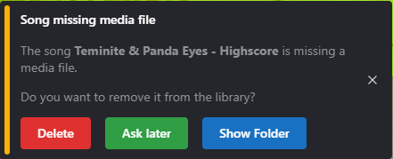

## 1.12.6 - TBD
### New Features
- Added new `Waveform` visualizer - A smooth connected wave that looks like a real audio waveform, inspired by the implementation from toxen-poly. This replaces the old waveform style which has been renamed to `PulseWave`.
  - Features smooth curves and harmonic lines for a more authentic waveform appearance
  - Supports rainbow mode with gradient colors across the waveform
  - Includes glow effects when visualizer glow is enabled
  - Uses quadratic curves for smooth interpolation between audio data points
- Added new `Waveform Circle` visualizer
  - Circular waveform that follows audio data with smooth curves
  - Configurable position (X/Y), size, smoothing level, and line thickness
  - Music-reactive with dynamic radius based on audio intensity
  - Supports rainbow mode with radial gradient colors
  - Includes glow effects and filled areas for enhanced visual impact
  - Features subtle wave motion and slower rotation for a mesmerizing effect
- Added new `Star Rush Effect` - A particle background effect where white stars/snow shoot outward from the center, accelerating as they move.
  - Configurable globally in Settings > Visual > Star Rush Effect
  - Can be overridden per-song in the song editor under "Song-specific visuals"
  - Music-reactive: particle spawn rate and speed increase with audio intensity
  - **Visualizer-reactive**: particle speed and acceleration are also affected by visualizer intensity
  - Adjustable intensity from 0.25x to 2x for customizable visual impact
  - Particles fade out as they age and are removed when off-screen for optimal performance
  - **Storyboard support**: Can be controlled dynamically with `starRushEffect`, `starRushIntensity`, and `starRushIntensityTransition` storyboard events

## 1.12.5 - 11-02-2025
## New features
- Preloading of storyboard image assets
- Performance settings tab
  - Added setting for enabling/disabling hiding song elements when not in view (On by default, always on for remote server)

## 1.12.4 - 7-02-2025
### New features
- More like a returning feature - The multi-select is back, and you can now select multiple by holding `CTRL` and dragging your mouse across songs.
### Why did this take so long to fix
- Functional icon on desktop again!
## 1.12.3 - 7-02-2025
### New features
- Toxen Stream downloading of missing songs from remote.
## 1.12.2 - 5-02-2025
### Hotfix
- Too many notifications on first time sync
## 1.12.1 - 4-02-2025
### Further implementation changes to Toxen Stream
- More of the same as previously, more stability and better implementation. 
## 1.12.0 - 4-02-2025
### Implementation changes to Toxen Stream
- This is another step towards a stable Toxen Stream. It will soon be for testing for a select few.
## 1.11.1 - 3-12-2024
### Hotfix
- Fixed options not displaying and saving correctly on song-specific visualizer-specific settings.
## 1.11.0 - 3-12-2024
### New Features
- Some visualizers now have furthered customizabilty. Starting with the new `Orb` visualizer, which can now have it's position changed on the screen, and the size adjusted. This can be done per visualizer, both globally and per-song. These visualizer specific settings will be added to more visualizers in the future. The options appear under the `Visualizer Style` selector, depending on which visualizer you have selected.
- `Orb` now has an `Opaque` option that can be toggled, accessible through the new visualizer-specific settings.
- `Orb` now has a slight glow effect around the inner circle when using `Opaque` mode.

### Changes
- Fixed `Sides` visualizer not applying glow.

## 1.10.1 - 1-12-2024
### Changes
- Changed the `Orb` from being static radius to dynamic based on song intensity.

## 1.10.0 - 1-12-2024
### New Features
- `Visualizer Glow` - This adds a glow effect to most of the visualizers. It can be toggled in the settings, per song, and through a storyboard. It's disabled by default. It can be quite performance heavy, especially on higher `Visualizer Size` values. Size `6` and below should work well for most mid-range computers. If you experience lag, try lowering the `Visualizer Size` value.
  - Glow is disabled on the following visualizers:
    - `Waveform` - Performance is too unstable with glow enabled.
    - `Orb` - Performance is too unstable with glow enabled.
- `Orb` visualizer - A circular visualizer style using bars that extrude from the center transparent circle.
  - Glow does not apply to this visualizer as it tanks performance.
- The ability to display the subtitles in place of the floating title. This can be toggled per song. It's disabled by default.

### Changes and Fixes
- Fixed Toxen's pause malfunctioning sometimes if "Pause With Click" is enabled since last update.
- Fixed certain settings having their default values not being selected visually unless explicitly selected.
- Rainbow visualizer now also applies to the progress bar and buffer indicator.

## 1.9.0 - 26-11-2024
While this update doesn't add a lot of new features, it's a big in terms of development.  
A major part of the codebase has been refactored to work on the web. This is part of a bigger plan to make Toxen available on the web for Toxen Premium users to stream their music from the Toxen server. If you have access to a web browser, be it on your phone, tablet, or computer, you'll be able to access your music library and play your songs from anywhere.

### New Storyboard Event: `Floating Title: Reactive`
- Added a new storyboard event that can be used to enable and disable Float Title's reactiveness.

### Disabling Hue Integration (for now)
- Disabled the Hue integration. This will be re-implemented in the future but had broken due to the Electron upgrade.

### Mobile Viewability
- Added a mobile view. Primarily made for the web version, but works on Desktop too. This is still in development and will be improved over time. It can be seen by simply resizing the window to a width under 768 pixels. Feedback on this view is appreciated.

### In-Development Features
This next section isn't features that are currently available, but features that are in development and will be available in the future.

#### Experimental Web Version
A Work in progress, but functional version of Toxen on web have been created. The aim is for as many Desktop features to be available on the web version as possible. Do keep in mind that the browser has limitations that prevent some of them. The web version will be made available to a select few for testing in the near future.

#### Song Synchronization
The Toxen stream server has been re-created and improved. It will be available for testing soon along with the web version. This will allow you to synchronize your songs to Toxen's server and stream them to your devices, as well as synchronize your songs when changes are made to the library or remote library.

## 1.8.0 - 20-08-2024
### Storyboard Editor Update
The entire storyboard editor has been reworked and improved. It's now more intuitive and easier to use.
  - Storyboards use a timeline system now, where you can add events on beats based on the BPM and starting point of the song.
  - More documentation will be added later.
  - More features will be added and feedback is appreciated.

## 1.7.1 - 19-06-2024
### New Features
- Added a genre field to songs. I am surprised I hadn't already added this. It's a very basic field, but it's there now.
### Changes
- Changed the song tag input to look nicer. Now using the same design as the other input fields.
- Changed floating title position selector to be more intuitive with a grid representation of the positions.

## 1.7.0 - 18-06-2024
### New Features
Added better playlists.
- Playlists can now be right-clicked to open a context menu with more options.
- Playlists can now have a custom image that will be displayed in the playlist selection screen.
- Playlists now have an `Apply background` checkbox that will apply the playlist's background to the main background when the playlist is selected. This can also be customized per song when a playlist is selected, and editing a song's settings. This will allow you to use a specific background for a song only when it is being played as part of a specific playlist. Themed playlisters, rejoice!
### Broken stuff
- Hue integration is currently not functional, but will be re-implemented in the future.
- Subtitle Editor (Which was previously in development) has been put on hold for now, as it was causing issues with the new Electron version.
- For now, the Toxen icon is broken until a fix is found. This has to do with the packager failing to package the icon correctly. Default Electron icon is used instead for now.
### Dependency Upgrades
- Major upgrade to Electron 30, migrating from Electron 12. This should improve stability and security.
- Upgraded to Node.js v22.2.0.
- Updated all dependencies to their latest versions, including now using React 18.
### Development process
- Migrated from webpack to Vite for faster development.
## 1.6.1 - 18-02-2024
- Added song options for Floating title custom text and toggleable underline, as well as margin for side positions.
## 1.6.0 - 30-09-2023
- Added new visualizer: `Waveform`!
- Added Media Downloader to the import tab. It can be used to download media from Youtube or Soundcloud, and import it to the library.
## 1.5.1 - 01-02-2023
- Added support for `jfif` images.
## 1.5.0 - 12-05-2022
Storyboard:
- Added Philips Hue experimental support. This will be extended further with more features and customization.

Song-Specific Background visuals:
- Added display positions for title of the song on the background. Colors follow visualizer colors. This new feature can be found when editing a song and scrolling down to the **Song-specific visuals** section.

## 1.4.2 - 29-10-2022
Hotfix: Fixed songs being shuffle even when the setting is disabled, when a songs ends on it's own.
## 1.4.1 - 28-10-2022
Playlists:
- Added the ability to change the name of a playlist.
- Removed playlist name length limit.
- Changed the layout of the playlist selection screen.

Storyboards:
- Added background changing effect.

Visualizer:
- Added `Visualizer Size` to the settings. It allows you to change how detailed the visualizer is. The higher the value, the more intense the impact on performance. 6 is the standard and should work well for most, but you can increase or decrease this if you experience lag or if you want to see more detail.
## 1.4.0 - 13-10-2022
New features
- First iteration of a storyboard implementation has been released!
  - Songs with a storyboard file (.tsb) can be selected in the song details panel. (More documentation will be added later)
  - An editor is available when pressing edit song. There's a button under where you would select Storyboard file.
  - The editor has a BPM Finder, you can tab to the beat and it will automatically calculate the BPM for you. The longer you do this for and more consistent you can keeep with the beat, the more accurate it will be.
- (Windows only) `.wma` files are now (indirectly) supported. They are converted to .mp3 when played first time.
  - If you have a lot of `.wma` files in your songs, you can use the button `Settings` -> `Advanced` -> `Convert all necessary audio files` to convert them all at once.
- You can import folders with drag and drop, and Toxen will look through the folder recursively for media files and copy them to the library.
- If you have a song folder which is missing a media file in settings, it will look for one in the folder. If none is found, Toxen will prompt you that it's missing a media file, and you'll have the option to delete the song folder.  

- Added Mini-Player mode! Press `CTRL + F11` to toggle it. When in miniplayer mode, double clicking the window will go back to normal mode.

Restricted access features
- Toxen stream server has been added. This is a new way to stream songs to the client. Currently this feature is restricted to the developer, but will be opened up as a `Premium` feature later. No existing features in Toxen will be restricted by `Premium`, don't worry.
- Login button in the top right corner has been added. This is currently only used for the stream server, but will be used for other features later. Registration is currently not possible and is restricted to a select few.
- Added `Sync to remote` on each song on the `Context menu` (right click). This will sync the song to the remote server. This only works if you're logged in as a user with `Premium`.

Changes
- The song panel will now only render songs that are in frame. This should improve overall performance if you have a lot of songs. (This was tested with over 2000 songs)
- Restyled the search box in the song panel.
- Changed the search bar in the song panel to require an `Enter` press to search. This should improve performance when typing in the search box.
  - It will still auto-reset the list when the search box is empty.
- Moved "Change playlist" into the header of the song panel.

Removed
- Removed `Migration` button from advanced mode sidebar

Bug fixes
- Fixed `Progress bar: Show milliseconds` showing weirdly and pushing other elements when a song is playing.
- Fixed Toxen crashing when importing the first song in an empty music folder.

## 1.3.3 - 2022-06-17
- Added alternative Toxen icon.
- Fixed Appbar title overflowing.
## 1.3.2 - 2022-06-17
- Fixed Toxen not downloading ffmpeg due to expired URL.
- Auto retrying up to 3 times if trimming fails.
## 1.3.1 - 2022-06-07
A couple minor fixes and improvements.
- Added new shortcuts for opening specific panels. Can be found in the Toxen dropdown in the top right corner under `Toxen`.
- Fixed up the remaining design changes on the Edit Song panel.
- Changes on a the Song Edit panel now save automatically when changed, so no need to click Save.

## 1.3.0 - 2022-04-23
New features
- Fully implemented song trimming feature. Right-click on a song and select `Trim` to start the quick and easy process.  
Works for both audio and video files. It will generate a new file with the same name as the original file, but with the prefix `trimmed.` and automatically apply it.  
You can always revert it back to the original file in the `Edit song` panel. `ffmpeg` is required for this feature to work. It will automatically download `ffmpeg` when it's required.  
`Currently this feature only works on Windows.`
- Added support for `.webp` images for backgrounds.
- Added option to show song progress in milliseconds along with the standard time format: `hh:mm:ss.ms`

Fixed bugs
- Fixed volume bar not displaying the correct volume on startup.

## 1.2.0 - 2022-04-18
Major changes:
- Massive overhaul of the sidepanel interactive element's design. Moved to using Mantine for the UI for certain elements, of which includes textboxes, dropdowns, buttons, sliders, and checkboxes. (You'll still find old design elements some places, but they will all be updated over time)
- Volume control is now a more accurate slider.
- Added customizable background for the sidepanel. It can be changed in `Settings > Sidepanel > Sidepanel Background`.

Minor changes:
- Fixed background dim being removed when Dynamic Lighting is disabled.

## 1.1.1 - 2022-04-14
Major changes:
- If a search is made in the song list, Toxen will only play songs that match the search.
  This will help if you're too lazy to make a queue or playlist with all the songs you want to play if they match a search term.

Minor changes:
- Fixed search field not searching after language tag.

## 1.1.0 - 2022-04-14
From now on, version format will follow the MAJOR.MINOR.PATCH format, instead of incrementing only the last number.

Major changes:
- Added option to have background images pulse along with the music. This can be toggled in global settings, and per song. It's `disabled` by default. Each song can choose to force enable, disable, or use the global (`<Default>`) setting.
- Added `Sides` visualizer. It's as the name implies, similar to Top and Bottom visualizers, but it shows the sides of the window instead.
- Added `Playlist` manager. Open it by using a song's context menu. You can also select multiple songs and manage multiple at once.
- Made textboxes smaller with smaller text. This is subject to change depending on feedback.

Minor changes:
- Fixed `0` background dim not actually being `0%` dimmed.

## 1.0.21 - 2022-04-13
Major changes:
- Changed the design of (some) context menus
- Changed right-clicking on the background to find the currently playing song in the song list. (Previously it opened current song's context menu)
- Added a `Delete` function to the song context menu.
- Changed how playlists are deleted to a confirm prompt instead of an extended context menu.
- Completely changed the Message Card to a more modern and simple design.
- Added a button to open the context menu on a song element. Displayed in front of the song name when hovering over it.

Minor changes:
- Fixed some miscoloring in the base theme.
- Removed Discord error prompts when failing to connect to the Discord API, as it caused spam when Discord isn't available on the computer.

## 1.0.20 - 2022/2/15
Major changes:
- Added tabs to settings
- Settings now automatically save when changed.
- Redesigned the color scheme for the base application, giving it a greener, more Toxen-like look.

Minor changes:
- Added a `Pause With Click` option under a new `Controls` tab.
  - Toggling this off will disable pausing the application when the mouse is clicked on the background.
- Created preparations for song trimming.

## 1.0.19 - 2021/11/16
Major changes:
- Changed how login works. Login can now be done even when not connected to a specific remote server, and will resolve to Toxen official server. Only users with a premium Toxen account can use a remote library.
- Added additional support for flac, ogg, and wav audio files.
- Added a custom app title bar instead of the default OS one. It will be consistent across all OSes.
- Added migration of playlists from Toxen2 if you had any prior to Toxen3
  - This can be done by going to the settings page, and enabling `Advanced UI`, then after saving, pressing on the `Migration` button in the sidebar.

Minor changes:
- Moved around some settings in `Edit Song` panel.
- Fixed the subtitles being selectable with the mouse when active.
## 1.0.18 - 2021/10/19
Major changes:
- Fixed a software breaking bug that was preventing Toxen from initializing properly on first run.
- Added customizable themes (Currently with no built-in editor or documentation - will come later)

Minor changes:
- Added buffering display when streaming from a Toxen server.
- Added expandable content components.
- Made the border around `Progress bars` / `Sliders` less round
- Added preparations for recording a song with the visuals as a video.
- Fixed Toxen attempting to connect to Discord infinitly if Discord is not installed, not running, or couldn't connect.
- Fixed subtitles not being parsed if the file used the wrong type of comma.
- Fixed toxen not being able to load songs from a remote server due to playlists not being supported remotely.
- Changed rainbow visualizer's rotation speed.

## 1.0.17 - 2021/09/23
Major changes:
- Added playlist functionality!
  - Playlists are still subject to change! It will be upgraded and improved in the future.
- Added Dynamic Background Lighting and an option to toggle it.
- Added background dim level to settings.
- Added `Advanced UI` to settings. It will enable more options in settings, as well as add a few new elements to the UI for more technical use.
  - If you're just a regular user of Toxen, this is not necessary to enable. It's meant for advanced users who want to work with Toxen in a more technical way.
- Added Discord integration. Settings for these are located in `Settings > Advanced UI > Discord`.
- Added song multi-select and multi-action.

Minor changes:
- Added fade-in/out animation for message cards.
- Added preparation for the storyboard system.
- Added warning in description on some options that has flashing colors.
- Changed how the currently playing track is displayed.
- Changed the default state of the side panel to be closed on startup.
- Fixed subtitleDelay song property not saving after reload.
- Fixed certain settings not applying as defaults, if they are not set.
- Added transparency to the sidepanel when not hovered over.

## 1.0.16
New stuff:
  - Added a less intrusive auto update prompt.
  - The title of Toxen now changes to the current song which is being played.
  - Added more functions to the context menu for songs.
  - Added queue to the song panel! (Right click on a song to add it to the queue.)
  - Added tooltip to Music progress bar to easier tell what timestamp your cursor is hovering over.
  - Added `srt` (SubRip) subtitle support, as well as a more customizable subtitle format specifically for Toxen, `tst` files!(**T**oxen **S**ub**T**itles)  
  More details under [New Subtitle support](#newsubtitlesupport).
    - `Toxen SubTitles` are a subtitle format that is used by Toxen, and is similar to, yet more customizable than the default `srt` format.
    - `tst` is being continuously updated over time.
  - Added export options for media files, image files, and subtitle files, as well as transpiling between subtitle formats.
  
Changed stuff:
  - Changed Checkbox icons from a slider-check-icon to a circular-check-icon

### New Subtitle support
Along with support for a standard `srt` subtitle format, Toxen supports a more customizable subtitle format, specifically for Toxen.  
If you don't know how srt subtitles work, you can read about them [here](https://en.wikipedia.org/wiki/SubRip).

#### How Toxen SubTitles work:
```
@color = white
@font = Arial
@size = 24

00:00:15,500 | 00:00:19,155
This will come in between the two timestamps!

00:00:19,155 | 00:00:22,238
This will come in between the other two timestamps above this text!

00:00:22,238 | 00:00:25,753
You can make it multiple lines
by simply making a new line.
Just make sure you leave no empty lines in between.

00:00:25,753 | 00:00:29,386
But you need to always have a new line at the end of each subtitle.

00:00:29,386 | 00:00:31,171
Timestamps are in the format:
hh:mm:ss,MMM
(h: hours, m: minutes, s: seconds, M: milliseconds)

00:00:31,171 | 00:00:33,199
@color = red
@fontSize = 30
And this text will be in the color red and font size 30! Other options are available like "@font".
If you have a line that begins with an @ symbol, you can escape it with "\".
\@ like this!
```

## 1.0.15
New stuff:
  - View change notes directly in Toxen from the sidebar under `Change logs`
  - Added `Repeat` functionality.
  - Added `Shuffle` functionality.
  - Added song `History` and proper `Next & Previous song` functionality using the history.
  - Added technical details to the `About`(Previously `Stats`) panel.
  - Added experimental streaming server as a Music Library folder, and user login when connected to a server.
    - This is still in development, and is not yet fully functional. It is currently not possible to host or connect to a streaming server,
    but will be in the future.
  - Added `Default background` functionality to the `Settings` panel.

Changed stuff
  - Changed `Stats` panel to `About` panel.
  - Changed `Music Library` change directory to a `Change Directory` button, and allowed the text field directly to change the directory, if they so desire.

## < 1.0.15
Changes prior to 1.0.15 hasn't been recorded. Changes from 1.0.15 onwards are listed above.